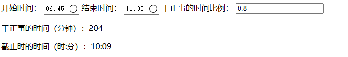

# calWorkTime
## 功能描述

可以根据开始时间、结束时间和比例，计算工作时间，帮助自学的时候督促自己。

例如，以上午时间段为例，在开始时间里选择06：45，结束时间里选择11：00，比例选择0.8，则可以计算出需要工作的时间为204分钟，对应工作到的时间为10：09，如下图所示

## todo

- [x] 自动设置开始时间为当前时间，结束时间为3小时后
- [x] 默认工作比例为0.8，也就是占据整个时间段的10%，可以自己调节
- [ ] 设置缓存，记录上一次的时间
- [ ] 设置3组不同的事件段
- [ ] 用更优雅的方式处理hh:mm格式的字符串所代表的时间，例如计算两个hh:mm格式的字符串所代表的时间的差值，用于替代本文的方案（使用一个假的yyyy-MM-dd 前缀和hh:mm字符串进行拼接，用于初始化一个Date对象

